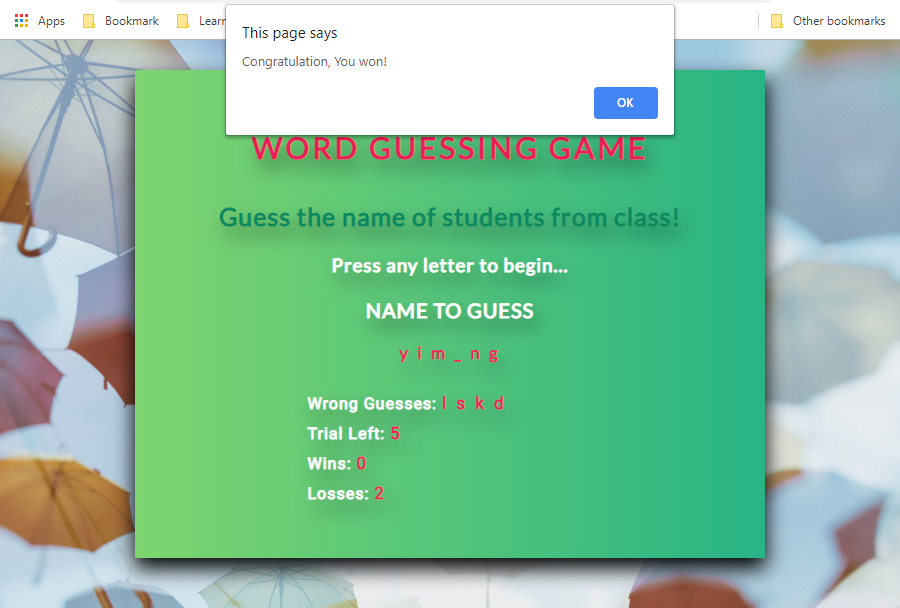
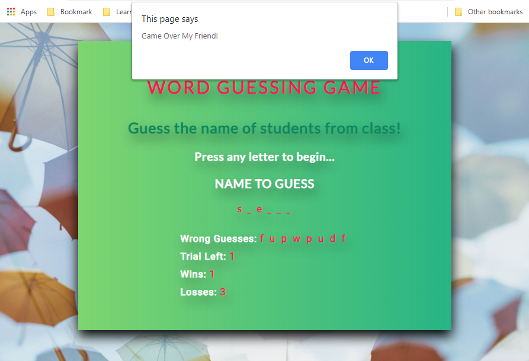
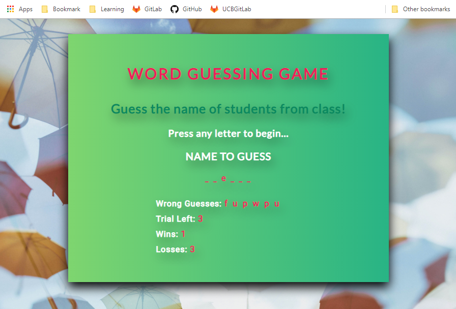

# Word Guess Game

## JavaScript Assignment - Create Word Guess Game

The goal of this homework assignment is to create a game that allows the user to guess for a word to match with the randomly sellected word from computer memory.

The user must guess a each letter until all the guessed letters match the word in memory.

The game will keep track of letters entered, wins and losses points, and reset the game when the user losses or wins a game.

## Run The App
[Click here to run](https://tvn9.github.io/WordGuessGame/)

## Technology Used
HTML, CSS, JAVASCRIPT 

## Game Features
1. Sellect a random hidden name for each new game play
2. Give user 9 trials to guess for the correct word/name
3. Matched the user's entered letter with each letter from the sellected word
4. Record wins/losses data, and update values on the game page
5. Reset the game when the user won or loss the round.

## Game Won Example

## Game Loss

## Game Play

